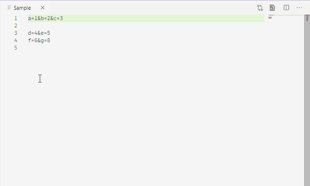
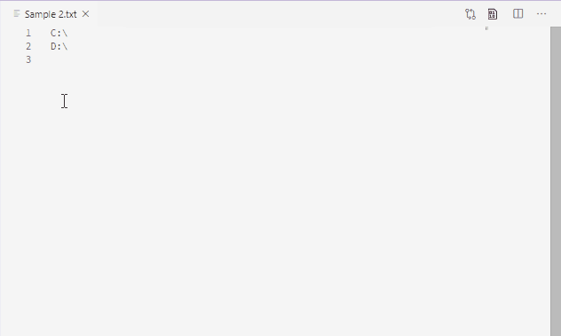

# quick-replace-in-selection README

Quick Replace In Selection let you search and replace by a regular expression within the current selection or the whole document.
It also support predefined rules to be used, and those rules allow multiple replacements in order at a time.

## Features

### Quick Replace In Selection



### Quick Replace In Selection (Use Rule)...



## Requirements

None.

## Extension Settings

This extension contributes the following settings:

* `quick-replace.rules`: define the rules to be used by the command `Quick Replace In Selection (Use Rule)...`

    E.g.
    ```
    {
        "Test Rule's Name": {
            "find": "\n",
            "replace": "\\n"
        }
    }
    ```

## Known Issues

None.

## Release Notes

See [CHANGELOG.md](CHANGELOG.md)

## License

MIT - See [LICENSE](LICENSE)
